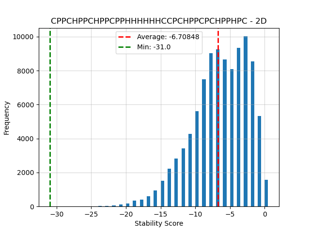
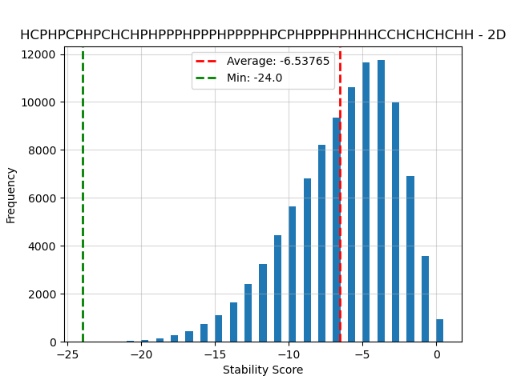
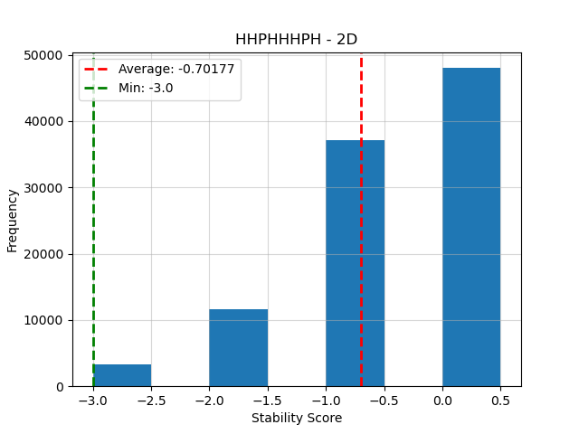
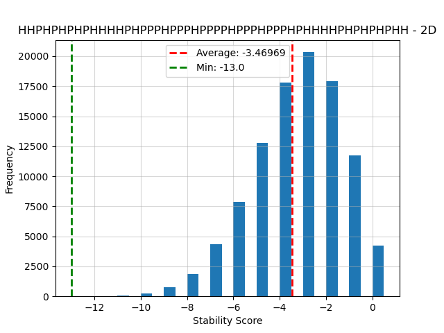
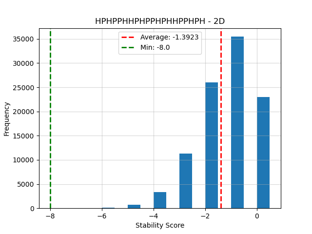
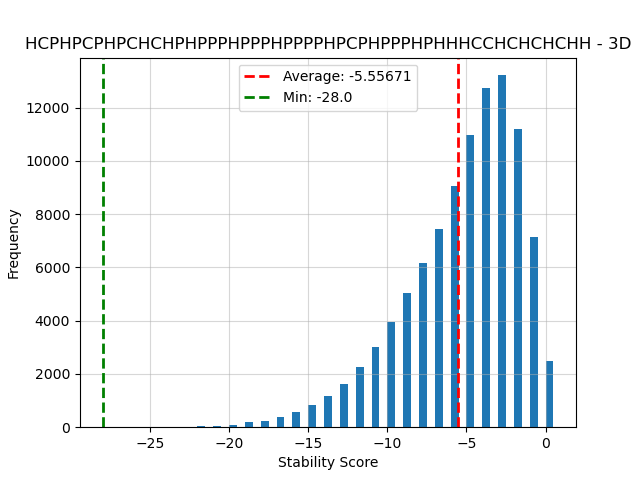
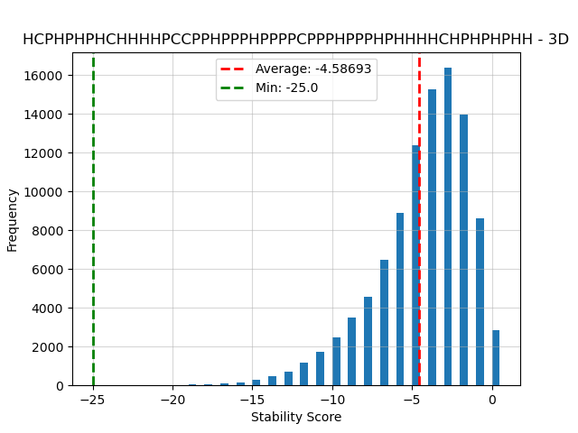
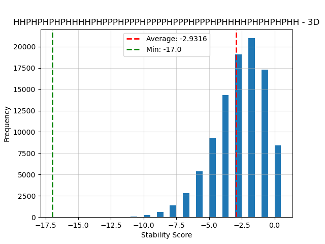
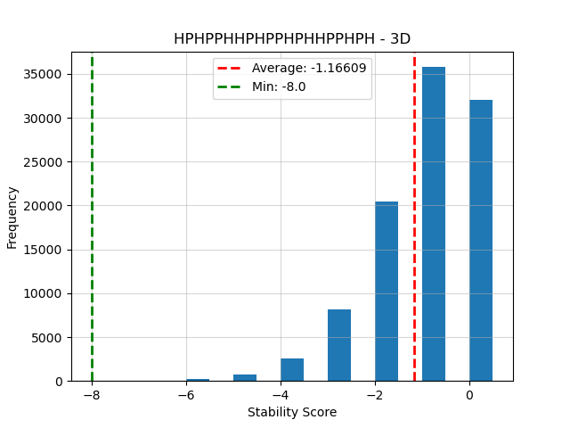
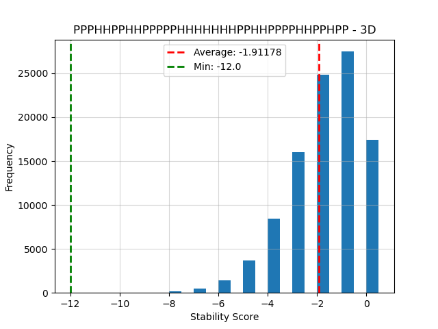

# Hardcoded Protein

## Introduction

This project seeks to find stable foldings for proteins. The aim is to find the folding with the lowest stability score. A protein consists of amino acids, which can be Polar (P) or Hydrophobic (H). Some proteins will contain the special aminoacid Cysteine (C). When two H acids are directly adjacent and not connected to each other, they form hydrogen bonds which increase the stability of the folding by -1. Cystein creates extra strong hydrogen bonds, so when two C acids are directly adjacent and not connected to each other they increase the stability score by -5. A C and an H acid which are adjacent will increase the stability score by -1. 

### Method

For this project we have tested several algorithms, and compared them to using a random algorithm. We started by establishing a baseline, where we ran the random algorithm 100000 times. The results of this can be found in the data/output/baseline_plots/ folder, and below in the *Results* section. We wrote 4 other algorithms, a Breadth-First Search algorithm, a Hillclimber algorithm, a Simulated Annealing algorithm and one based on Harvard research using Fragment Regrowth Energy-guided Sequential Sampling (FRESS).

#### Breadth First Search with Random sampling.

The algorithm employs a search strategy that explores the solution space up to a specified depth in the tree, which is 6 for 2D and 4 for 3D. At the last depth, the algorithm calculates the scores of each valid folding. To enhance efficiency, it prunes the search tree by eliminating rotations, mirroring at the last depth. The algorithm selects the best-performing solution at the last level, preferring one randomly in the case of ties. This is then done till depth 8, and for each depth this process will be done. The algorithm then determines the steps to take based on the performance of the current folding configuration. It explores multiple random steps and evaluates their average scores to make an informed decision. To further refine the folding, the algorithm repeats the entire process three times, allowing for varied exploration. Finally, it identifies the folding configuration with the most negative score, indicating optimal performance, and selects it as the solution to the folding problem. This comprehensive approach aims to strike a balance between thorough exploration of the solution space and efficient pruning for improved computational efficiency.

#### Hillclimber algorithm

For the Hilclimber algorithm we randomly selected a part of the protein between 3 and 10 acids long, and used a BFS to find all possible foldings for this part with the given start and end positions. Then we checked if this resulted in a valid fold, i.e., a fold with no overlap. If this resulted in a better score the new folding was accepted. A big downside of the Hillclimber algorithm is that it is very sensitive to getting 'stuck' in a local minimum, where any change to the protein results in a worse score, but an overall better score is possible. To solve this we also implemented a Simulated Annealing algorithm.

#### Simulated Annealing algorithm

The Simulated Annealing (SA) algorithm works exactly the same as the Hillclimber algorithm, with one key difference: where a Hillclimber accepts only improvements, with a SA algorithm there is a chance to accept a change also when it leads to a worse score. The chance for accepting a new folding is given by 2<sup>(old score - new score)/temperature</sup>. The larger the temperature, the bigger the chance that a larger regression is accepted. The temperature is decreased with each iteration, resulting in a Hillclimber situation after a certain number of iterations, depending on the cooling rate. For our SA algorithm we chose a starting temperature of 10 (meaning a regression of 10 stability points had a 50% chance of being accepted), and a cooling rate of 0.0025.

#### FRESS algorithm

The FRESS (Fragment Regrowth Energy-guided Sequential Sampling) algorithm enhances protein folding by iteratively refining a protein's structure for better stability. Initially, it generates a random protein fold, ensuring no overlap in the structure. The algorithm then analyzes each amino acid's connections, focusing on points without negative stability scores as targets for improvement.
In the improvement phase of the algorithm, FRESS segments the protein into three parts: start, middle, and end. It assesses each segment for its stability contribution and non-polar amino acid count. Based on this analysis, it suggests changes in the segment with the least contributions to the stability of the protein. The algorithm then refolds this segment, randomly trying new folds and retaining those that enhance stability. The process iterates, refining the protein structure towards a more stable form until no improvement is suggested by the algorithm.

## Results

### Baseline

<p style="text-align: center;">
    
    
    
    
    
    
</p>
<p style="text-align: center;">
    
    
    
    
    
    
</p>
<p style="text-align: center;">
    
    
    
    
    
    
</p>

## Time

In the two tables below is the estimation on how long each algorithm takes to find a folding for a specific length displayed.

### 2D

```
|        Algorithm         |  Estimated time, length ~10   |  Estimated time, length ~10-20   |  Estimated time, length ~20-30   |  Estimated time, length ~30-40   |
| -------------------------| ----------------------------- | -------------------------------- | -------------------------------- | -------------------------------- |
| Baseline                 |             ~1.1s             |             ~1.3s                |            ~1.5s                 |             ~2.0s                |
| Hillclimber              |            ~0.004s            |            ~0.065s               |           ~0.083s                |            ~0.110s               |
| Simulated Annealing      |            ~0.005s            |            ~0.060s               |           ~0.082s                |            ~0.098s               |
| BFS with Random sampling |             ~4.2s             |             ~5.0s                |            ~7.0s                 |             ~9.0s                |
| FRESS                    |             ~0.2s             |             ~0.6s                |            ~1.0s                 |             ~2.2s                |
```


### 3D

```
|        Algorithm         |  Estimated time, length ~10   |  Estimated time, length ~10-20   |  Estimated time, length ~20-30   |  Estimated time, length ~30-40   |
| -------------------------| ----------------------------- | -------------------------------- | -------------------------------- | -------------------------------- |
| Baseline                 |             ~1.2s             |            ~1.4s                 |             ~1.5s                |             ~2.0s                |
| Hillclimber              |            ~0.063s            |            ~6.43s                |            ~12.15s               |            ~11.95s               |
| Simulated Annealing      |            ~0.097s            |            ~5.82s                |            ~10.4s                |            ~12.86                |
| BFS with Random sampling |             ~3.5s             |            ~4.0s                 |             ~20s                 |             ~32s                 |
| FRESS                    |             ~0.3s             |            ~0.5s                 |             ~0.5s                |             ~0.9s                |

```


## Usage

First install requirements using

```bash
pip install -r requirements.txt
```

Then run the program by running

```bash
python main.py <fold_algorithm> <dimensions> <iterations> <y/n> ['generate']"
```

where `<fold_algorithm>` is the filename (without .py) of one of the algorithms in the code/algorithms folder, `<dimensions>` is either 2 or 3 for 2D or 3D folding, respectively, `<iterations>` is the number of iterations that the algorithm should be run, `<y/n>` is whether ("y") or not ("n") to include the Cysteine protein, and the optional "generate" argument can be used to generate the csv data.