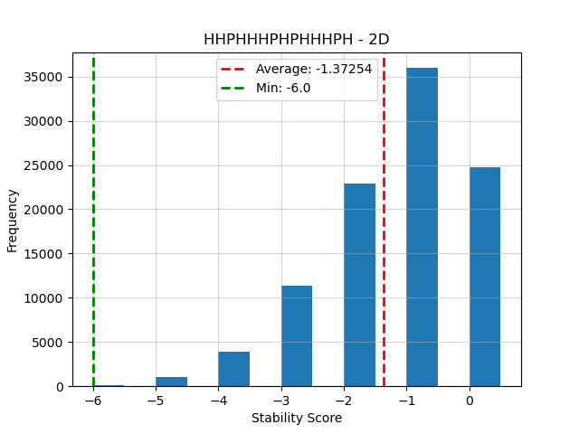
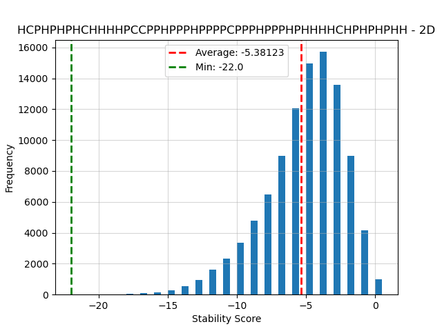
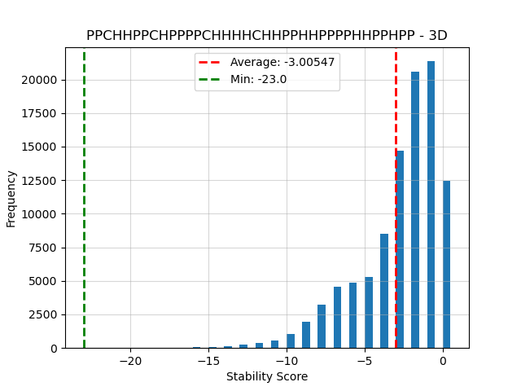

# Baseline

### Opzet

Voor onze baseline hebben we een willekeurige vouwing voor 4 eiwitten met H en P aminozuren en 5 eiwitten met H, P en C aminozuren in 2D en in 3D gemaakt. Dit hebben we elk 1000 keer herhaald voor een totaal van 18000 datapunten. De scores voor deze willekeurige vouwingen zijn afgebeeld in de figuren hieronder.

Ons willekeurig algoritme hebben we zo geïmplementeerd dat invalide oplossingen (oplossingen waarbij het eiwit zichzelf kruist) niet worden gegenereerd. Dit doen we door de willekeurige keten te laten 'backtracken' als er een doodlopend pad voorkomt. Dit betekent dat onze baseline uitsluitend valide oplossingen meeneemt.

Met het oog op de beschikbare tijd hebben we 2 verschillende eiwitten, en voor elk eiwit 1000 willekeurige vouwingen gegenereerd. Dit is een vrij kleine steekproef, maar door de gemiddelde score van deze 1000 vouwingen te berekenen kunnen we toch een idee krijgen van wat de score van een willekeurige vouwing is. Op basis hiervan kunnen we bepalen hoe 'goed' onze algoritmen zijn.

We zullen het aantal eiwitten vergroten voor onze baseline, aangezien wij ons hebben gefocused op de code voor het verkrijgen van de data. Na het hebben van ons daadwerkelijke algoritme dan zijn wij in staat om voor beiden het aantal eiwitten te vergroten en meer representatieve resultaten te verkrijgen. Nu we de basisgegevens hebben verzameld, kunnen we verder gaan met het ontwikkelen en verfijnen van ons algoritme.

### Resultaten

In de bestanden 2D.csv, 2D_C.csv, 3D.csv, 3D_C.csv staan de resultaten van de verschillende testen in het volgende format: de dimensie waarin deze vouwing is ontstaan, een string die de volgorde van aminozuren in het eiwit weergeeft, de score van de vouwing. Hieronder volgen figuren die de verdeling van scores en de gemiddelde waarde van een willekeurige vouwing laten zien.

# 2D

# 2D with C

# 3D

# 3D with C

